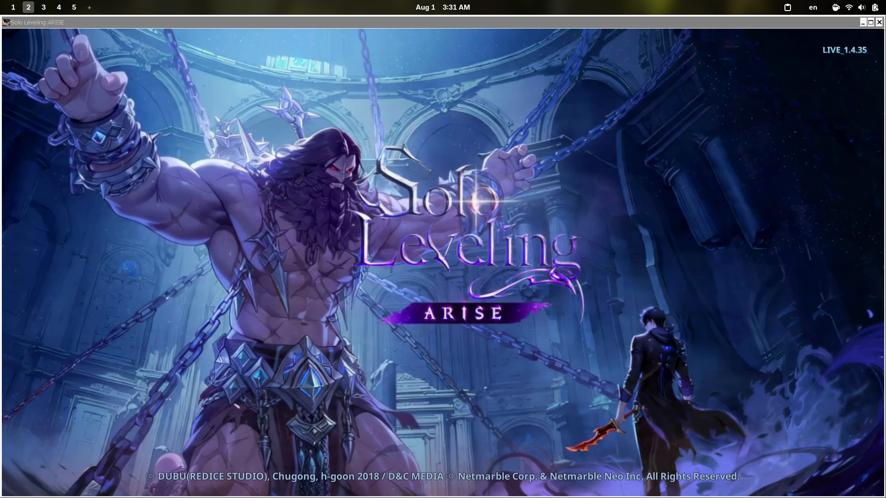

# Solo Leveling: ARISE — Linux Direct Launch Fix (Lutris) ⚔️🎮



This repository provides a custom **Lutris YAML installer** for running **Solo Leveling: ARISE** seamlessly on Linux (Arch Linux, Steam Deck, Ubuntu, Fedora, etc.), specifically targeting NVIDIA/Intel hybrid graphics setups.

---

## 🔍 Problem Solved

The official **Netmarble Launcher** often fails under Wine/Proton due to Electron framework bugs (`EBADF` errors, blank transparent windows), EGL/NVIDIA rendering issues, and XIGNCODE3 anti-cheat hangs.

This script bypasses the problematic launcher entirely and sets up a **direct executable launch** using optimal DXVK and Wine overrides.

---

## 🚀 Quick Installation

### Option 1: Automatic Download via Terminal (Recommended)

Run this command in your terminal to fetch the latest installer script directly into your home folder:

```bash
curl -sL https://raw.githubusercontent.com/votetz/solo-leveling-arise-linux-fix/main/solo-leveling-arise.yaml -o ~/solo-leveling-arise.yaml
```
